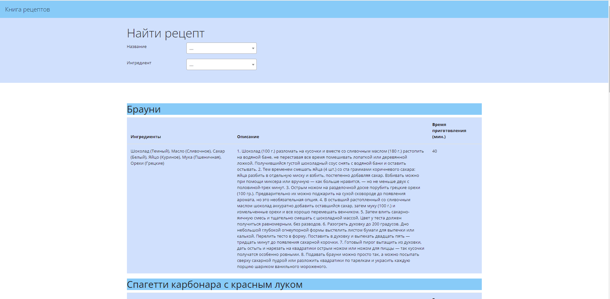
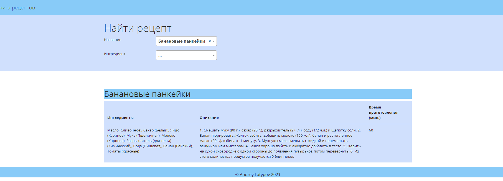
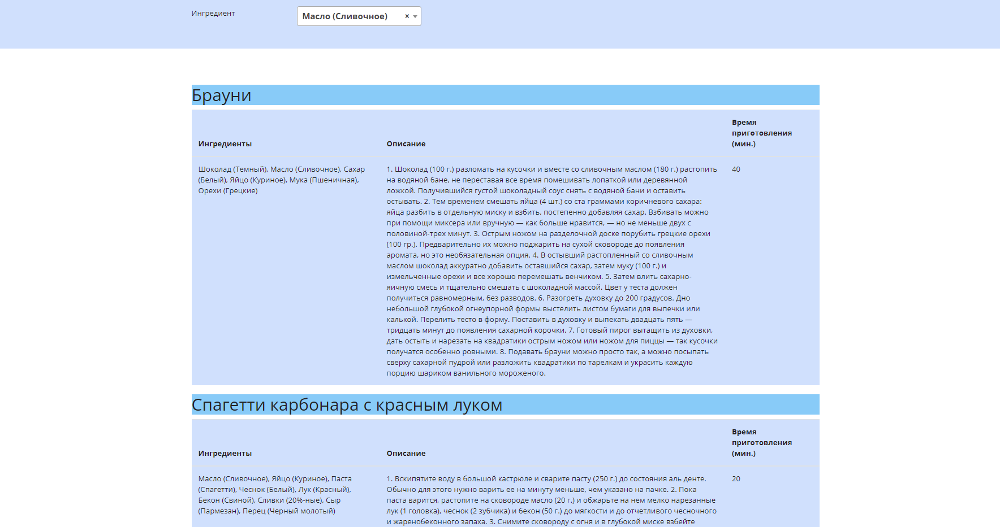
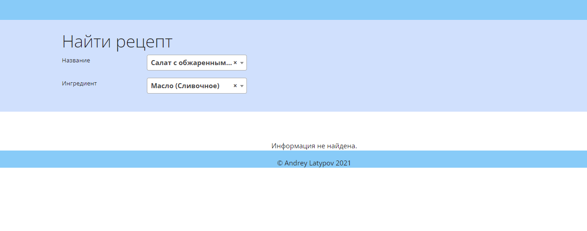
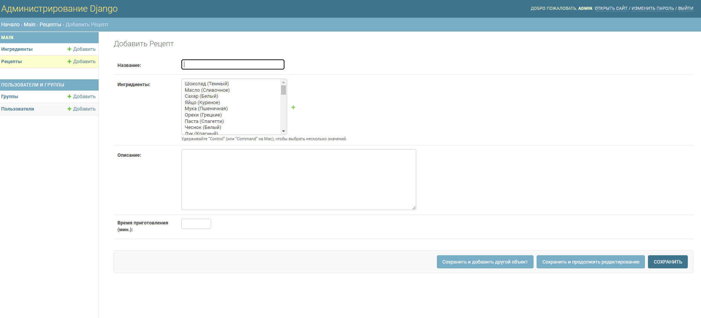

# Книга рецептов

Проект «Книга рецептов» в виде веб-сайта на Django 3.

## Использование Docker

### Настройка проекта

Внесите при необходимости корректировки в переменные окружения в файле `.env.dev`

### Сборка образов и запуск контейнеров

В корне репозитория выполните команду:

```bash
docker-compose up --build
```

При первом запуске данный процесс может занять несколько минут.

Для остановки контейнеров откройте новую сессию в терминале и выполните команду:

```bash
docker-compose stop
```

Если при сборе проекта возникли ошибки с подключением к БД, попробуйте в файле `requirements.txt` заменить 
строчку `psycopg2==2.9.1` на `psycopg2-binary==2.9.1` и выполните сборку заново.

### Инициализация проекта

Для того чтобы выполнять команды внутри контейнера приложения, выполните команду:

```bash
docker-compose exec app bash
```

Если при выполнении этой команды Вы получили ошибку:

`OCI runtime exec failed: exec failed: container_linux.go:380: starting container process caused: exec: "bash": executable file not found in $PATH: unknown`

Попробуйте выполнить следующее:

```bash
docker-compose exec app sh
```

### Применение миграций

Для выполнения миграций выполните команду внутри контейнера приложения:

```bash
python recipebook/manage.py migrate
```

### Добавление фикстур

Для того чтобы наполнить сайт начальными данными, выполните следующую команду внутри контейнера приложения:

```bash
python recipebook/manage.py loaddata ingredients recipes
```

### Добавление новых данных

Для того чтобы добавить новые данные, нужно создать суперпользователя:

```bash
python recipebook/manage.py createsuperuser
```

После того как суперпользователь был создан, вы можете добавлять новые данные на сайт.

## Описание проекта

Проект доступен по адресу http://127.0.0.1:8000

### Главная страница

Проект представляет собой веб-сайт с рецептами, которые добавляет пользователь, с 
возможностью фильтрации по названию рецепта и по ингредиенту. 

Веб-сайт выглядит следующим образом:



Вверху сайта расположен фильтр. В выпадающем списке "Наименование" хранятся названия всех рецептов.
В выпадающем списке "Ингредиент" хранятся все ингредиенты (без повторений), которые использовались для описания рецепта

Если выбрать из первого выпадающего списка имя рецепта, то на главном окне будет только данный рецепт



Если выбрать ингредиент, то на странице будут показаны те рецепты, в которых используется выбранный ингредиент



Если выбрать ингредиент во втором выпадающем списке, который не встречается в выбранном рецепте из первого 
выпадающего списка, то никакой информации выведено не будет



### Суперпользователь

Если Вы создали суперпользователя, то можете авторизоваться по адресу: 
http://127.0.0.1:8000/admin

Для того чтобы добавить новый рецепт, нажмите на кнопку `+Добавить` напротив таблицы `Ингредиенты`

Добавление нового рецепта выглядит следующим образом:



В поле `Название` введите название рецепта. В поле `Ингредиенты` Вы можете выбрать
ингредиенты для своего рецепта. Если ингредиента, который Вам нужен, нет в данном списке, то
нажмите `+` и добавьте ингредиент. В поле `Описание` опишите Ваш рецепт (как его приготовить).
В поле `Время приготовления` укажите целое число, сколько готовиться Ваш рецепт примерно в минутах.

После заполнения всех полей нажмите кнопку `Сохранить`. Теперь Ваш рецепт появится на главном экране.
